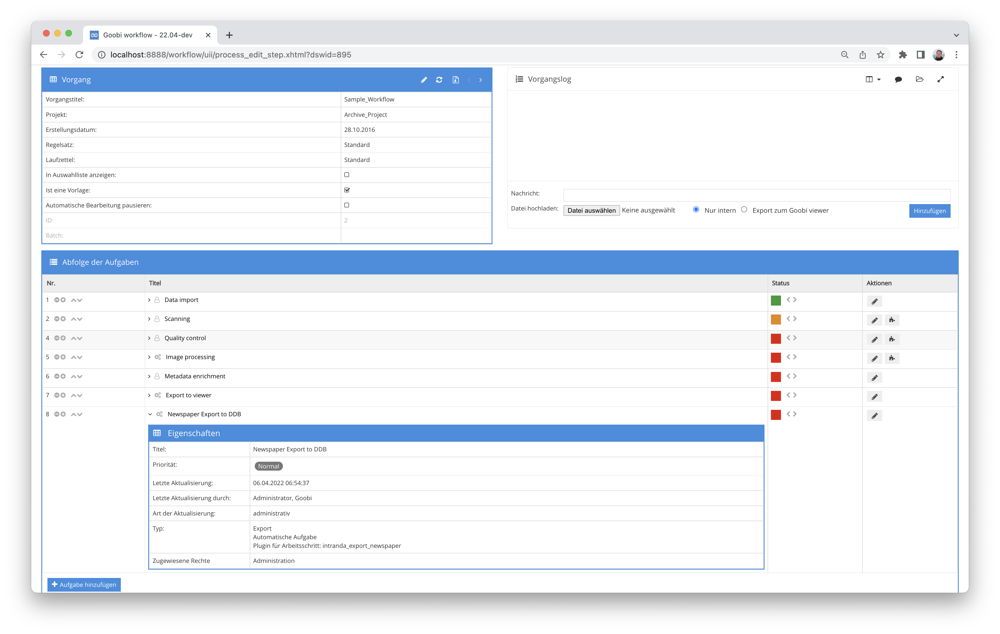

## Einführung

Das Plugin dient zur Erstellung der METS Struktur für den Import in das Zeitungsportal der Deutschen Digitalen Bibliothek. Dabei wird wird für jede Ausgabe des Vorgangs eine eigene METS/MODS Datei erstellt.

Die Ausgabe kann weitere Strukturdaten wie Artikelbeschreibungen oder Beilagen enthalten. Die einzelnen Ausgaben sind kompatibel mit der von der Deutschen Digitalen Bibliothek erwarteten und hier beschriebenen Struktur:

[https://wiki.deutsche-digitale-bibliothek.de/display/DFD/Ausgabe+Zeitung+1.0](https://wiki.deutsche-digitale-bibliothek.de/display/DFD/Ausgabe+Zeitung+1.0)


## Installation
Das Plugin besteht aus der folgenden Datei:

```bash
plugin_intranda_export_newspaper-base.jar
```

Diese Datei muss in dem richtigen Verzeichnis installiert werden, so dass diese nach der Installation an folgendem Pfad vorliegt:

```bash
/opt/digiverso/goobi/plugins/export/plugin_intranda_export_newspaper-base.jar
```

Daneben gibt es eine Konfigurationsdatei, die an folgender Stelle liegen muss:

```bash
/opt/digiverso/goobi/plugins/config/plugin_intranda_export_newspaper.xml
```


## Überblick und Funktionsweise
Zur Inbetriebnahme des Plugins muss dieses für eine Aufgabe im Workflow aktiviert werden. Dies erfolgt wie im folgenden Screenshot aufgezeigt durch Auswahl des Plugins `intranda_export_newspaper` aus der Liste der installierten Plugins.



Da dieses Plugin üblicherweise automatisch ausgeführt werden soll, sollte der Arbeitsschritt im Workflow als automatisch konfiguriert werden. Darüber hinaus muss die Aufgabe als Export-Schritt markiert sein.

Nachdem das Plugin vollständig installiert und eingerichtet wurde, wird es üblicherweise automatisch innerhalb des Workflows ausgeführt, so dass keine manuelle Interaktion mit dem Nutzer erfolgt. Stattdessen erfolgt der Aufruf des Plugins durch den Workflow im Hintergrund und führt die folgenden Arbeiten nacheinander durch:

* Lesen der Metadaten
* Validierung, ob es sich um eine Zeitung handelt
* Validierung, ob alle Pflichtmetadaten wie ZDB ID für A- und O-Aufnahme, Identifier der Zeitung, Nutzungslizenz, Erscheinungsdatum, Nummern für jede Ausgabe ausgefüllt sind
* Prüfung, ob generierbare Metadaten bereits vorliegen oder erstellt werden müssen (Identifier der einzelnen Ausgaben, Sortiernummer basierend auf der Ausgabennummer)
* Generierung von noch fehlenden Pflichtmetadaten
* Erzeugen der METS/MODS Struktur für die Ausgabe
* Kopieren der Metadaten der Ausgabe Zeitschrift in die neue Datei
* Überführen der Metadaten des Zeitungsjahrgangs und der Gesamtaufnahme in die neue Datei. Dazu muss es im Regelatz für jedes Metadatum, dass aus der Gesamtaufnahme übernommen werden soll, ein gleichnamiges Feld mit dem Präfix "newspaper" und für jedes Metadatum aus dem Jahrgang ein Metadatum mit dem Präfix "year" geben und im Issue erlaubt sein. Metadaten, bei denen kein Äquivalent mit dem Präfix existiert, werden beim Export nicht übernommen.
* Generierung der Dateigruppen für die in der Ausgabe verlinkten Bilder. Dabei werden entwieder die Einstellungen aus der Projektkonfiguration genutzt, oder davon abweichende Daten aus der Konfigurationsdatei, falls zum Beispiel neben dem regulären Export noch eine Lieferung an ein anderes Portal geplant ist.
* Speichern der Datei im konfigurierten Ordner
* falls konfiguriert, kopieren der Bilder und ALTO Daten in eigene Unterordner pro Ausgabe


## Konfiguration
Die Konfiguration des Plugins erfolgt über die Konfigurationsdatei `plugin_intranda_export_newspaper.xml` und kann im laufenden Betrieb angepasst werden. Im folgenden ist eine beispielhafte Konfigurationsdatei aufgeführt:

{{CONFIG_CONTENT}}


Im ersten Bereich `<export>` werden einige globale Parameter gesetzt. Hier wird festgelegt, ob neben den Metsdateien auch Bilder und ALTO exportiert werden sollen (`<exportImageFolder>, <exportAltoFolder>` `true`/`false`), in welches Verzeichnis der Export durchgeführt werden soll (`<exportFolder>`) und welche Resolver für die METS Datei (`<metsUrl>`) und den Link auf den veröffentlichten Datensatz (`<resolverUrl>`) geschrieben werden sollen.

Im zweiten Bereich können von den Projekteinstellungen abweichende Angaben gemacht werden. Dazu können sowohl filegroups überschrieben werden als die einzelnen Felder der Inhaltlichen Einstellungen.

In `<metadata>` werden eine Reihe von Metadaten definiert, die für die Validierung und Generierung von Daten genutzt werden.

Der letzte Bereich `<docstruct>` definiert den internen Namen des zu erzeugende Strukturelements.
