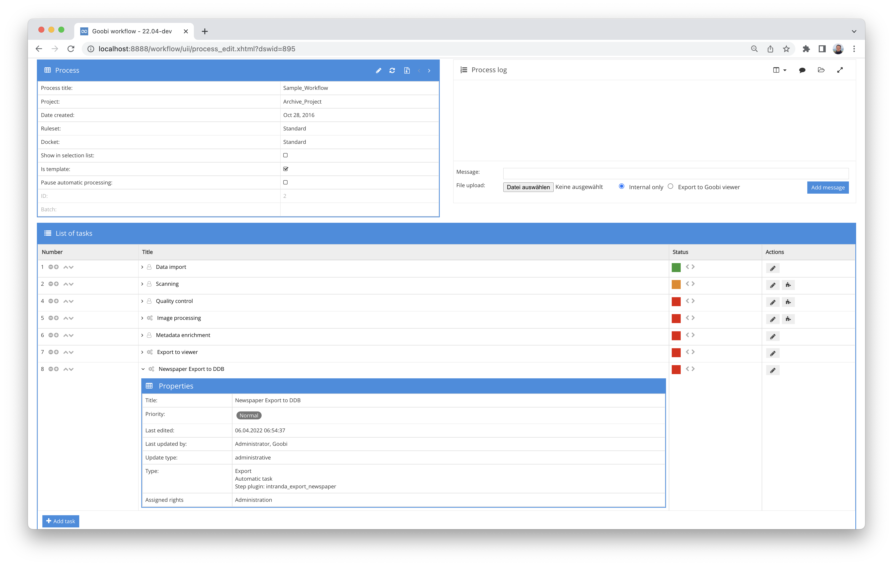

## Introduction
The plugin is used to create the METS structure for import into the newspaper portal of the German Digital Library. A separate METS/MODS file is created for each issue of a process.

The issue can contain additional structural data such as article descriptions or supplements. The individual issues are compatible with the structure expected by the German Digital Library and described here:

[https://wiki.deutsche-digitale-bibliothek.de/display/DFD/Ausgabe+Zeitung+1.0](https://wiki.deutsche-digitale-bibliothek.de/display/DFD/Ausgabe+Zeitung+1.0)


## Installation
The plugin consists of the following file:

```bash
plugin_intranda_export_newspaper-base.jar
```

This file must be installed in the correct directory so that it is available at the following path after installation:

```bash
/opt/digiverso/goobi/plugins/export/plugin_intranda_export_newspaper-base.jar
```

In addition, there is a configuration file that must be located in the following place:

```bash
/opt/digiverso/goobi/plugins/config/plugin_intranda_export_newspaper.xml
```


## Overview and functionality

To activate the plugin, it must be activated for a task in the workflow. This is done as shown in the following screenshot by selecting the `intranda_export_newspaper` plugin from the list of installed plugins.


As this plugin should usually be executed automatically, the step should be configured as automatic in the workflow. In addition, the task must be marked as an export step.

Once the plugin has been fully installed and set up, it is usually run automatically within the workflow, so there is no manual interaction with the user. Instead, the workflow invokes the plugin in the background and performs the following tasks:

* Reading the metadata
* Validation of whether the document type is a newspaper
* Validate whether all mandatory metadata such as ZDB IDs, newspaper identifier, license, publication date, numbers for each issue have been filled in
* Checking whether generatable metadata already exists or needs to be created like identifier of the individual issues, sorting number based on the issue number
* Generation of missing mandatory metadata
* Generate the METS/MODS structure for the individual issue
* Copy the metadata of the issue to the new file
* Transferring the metadata of the newspaper year and the newspaper record to the new file. To do this, there must be a field of the same name with the prefix ‘newspaper’ in the ruleset for each metadata that is to be copied from the newspaper record and a metadata with the prefix ‘year’ for each metadata from the volume and this must be permitted in the export issue element. Metadata for which there is no equivalent with the prefix will not be included in the export.
* Generation of the file groups for the images linked in the issue. The settings from the project configuration are used, or different data from the configuration file if, for example, a delivery to another portal is planned in addition to the regular export.
* Save the file in the configured folder
* If configured, copy the images and ALTO data to separate subfolders for each output


## Configuration
The configuration of the plugin is done via the configuration file `plugin_intranda_export_newspaper.xml` and can be adjusted during operation. The following is an example configuration file:

{{CONFIG_CONTENT}}

Some global parameters are set in the first area `<export>`. Here you can specify whether images and ALTO should also be exported in addition to the METS files (`<exportImageFolder>, <exportAltoFolder>` `true`/`false`), to which directory the export should be carried out (`<exportFolder>`) and which resolvers should be written for the METS file (`<metsUrl>`) and the link to the published data (`<resolverUrl>`).

In the second area, you can make specifications that differ from the Goobi project settings. Filegroups and the individual fields of the project settings can be overwritten.

In `<metadata>`, a range of metadata is defined that is used for validating and generating data.

The last area `<docstruct>` defines the internal name of the structure element to be generated.
